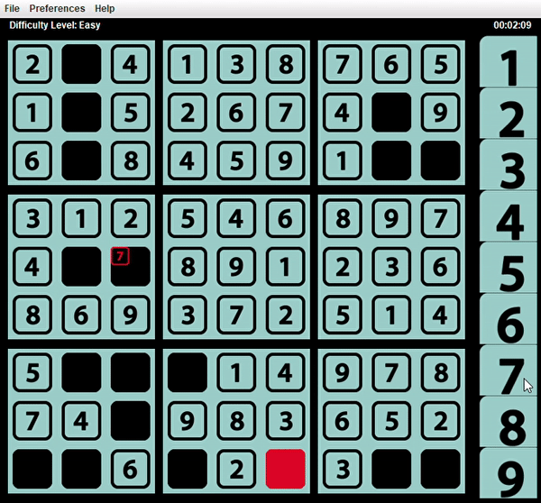

# About Me
#### 😄 Name: **✨Ellie✨**
#### 📚 Education: In Progress
> + ###### *Associate In Science - Mesa Community College - Completed in 2020*
> + ###### *B.S. Computer Science - Ira A. Fulton Schools of Engineering - Arizona State University - By 2023*
#### 📫 Reach Me At: emoore23@asu.edu
#### 💬 Ask Me About: Anything Java-related
#### 🌱 Learning: C++, Assembly, Javascript, Python
#### 👾 Pronouns: She/Her
#### ☕ Fun Fact: I love Java almost as much as I love coffee!
#### ⚡ Interests: Math, Physics, Design Patterns, Operating Systems, Artificial Intelligence, Data Structures, Algorithms
#### (I dump lots of code on here... Most of it is pretty bad... Read at your own risk lol)
# Favorite Projects
## [Charon Perft (2021)](https://github.com/RedBedHed/Charon)
#### **A stockfish (and lc0) derived chess move-generator.**
### These are Charon's perft results !!!
###### *(single-threaded, 1.6 ghz i5, strictly-legal moves only.)*
 <pre>
  <code>
        .~* Charon Perft *~.

        *. by Ellie Moore .*

        Starting Position:

            H   G   F   E   D   C   B   A
          +---+---+---+---+---+---+---+---+
        1 | R | N | B | K | Q | B | N | R | 1
          +---+---+---+---+---+---+---+---+
        2 | P | P | P | P | P | P | P | P | 2
          +---+---+---+---+---+---+---+---+
        3 |   |   |   |   |   |   |   |   | 3
          +---+---+---+---+---+---+---+---+
        4 |   |   |   |   |   |   |   |   | 4
          +---+---+---+---+---+---+---+---+
        5 |   |   |   |   |   |   |   |   | 5
          +---+---+---+---+---+---+---+---+
        6 |   |   |   |   |   |   |   |   | 6
          +---+---+---+---+---+---+---+---+
        7 | p | p | p | p | p | p | p | p | 7
          +---+---+---+---+---+---+---+---+
        8 | r | n | b | k | q | b | n | r | 8
          +---+---+---+---+---+---+---+---+
            H   G   F   E   D   C   B   A

        perft(1) -  0.000 seconds -         20 nodes visited.
        perft(2) -  0.000 seconds -        400 nodes visited.
        perft(3) -  0.000 seconds -       8902 nodes visited.
        perft(4) -  0.000 seconds -     197281 nodes visited.
        perft(5) -  0.031 seconds -    4865609 nodes visited.
        perft(6) -  0.656 seconds -  119060324 nodes visited.
 </code>
</pre> 
## [Bit Tac Toe (2021)](https://github.com/RedBedHed/BitTacToe)

## [Tetris (2020)](https://github.com/RedBedHed/Tetris) 

## [Sudoku (2019)](https://github.com/RedBedHed/Sudoku) 

