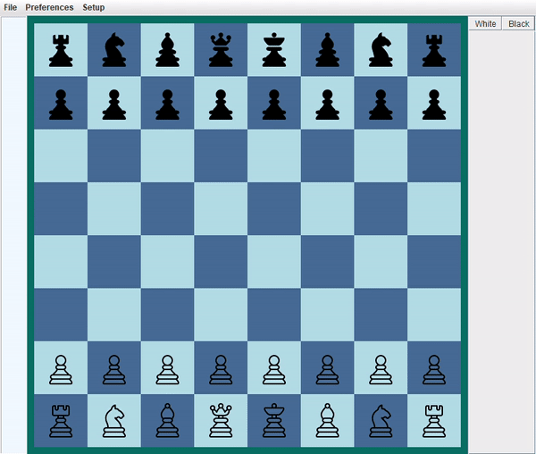

# About Me
#### 😄 Name: **Ellie**
#### 📜 Education: In Progress
> + ###### *Associate In Science - Mesa Community College - Completed in 2020*
> + ###### *B.S. Computer Science - Ira A. Fulton Schools of Engineering - Arizona State University - Complete by 2023*
#### 📫 Reach Me At: emoore23@asu.edu
#### 💬 Ask Me About: Anything Java-related
#### 🌱 Learning: C++, Python, Javascript
#### 👾 Pronouns: She/Her
#### ☕ Fun Fact: I love Java
#### ⚡ Interests: Design Patterns, Operating Systems, Artificial Intelligence, Data Structures
# Favorite Projects
## [Tetris (2021)](https://github.com/RedBedHed/Tetris) 

## [Chess (2020)](https://github.com/RedBedHed/Grey-Sky-Chess) 

## [Sudoku (2019)](https://github.com/RedBedHed/Sudoku) 

<!--
**RedBedHed/RedBedHed** is a ✨ _special_ ✨ repository because its `README.md` (this file) appears on your GitHub profile.

Here are some ideas to get you started:

- 🔭 I’m currently working on ...
- 🌱 I’m currently learning ...
- 👯 I’m looking to collaborate on ...
- 🤔 I’m looking for help with ...
- 💬 Ask me about ...
- 📫 How to reach me: ...
- 😄 Pronouns: ...
- ⚡ Fun fact: ...
-->
