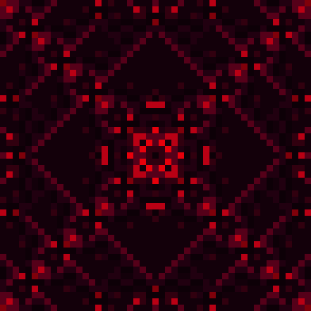
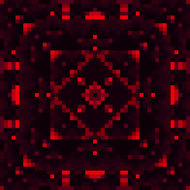
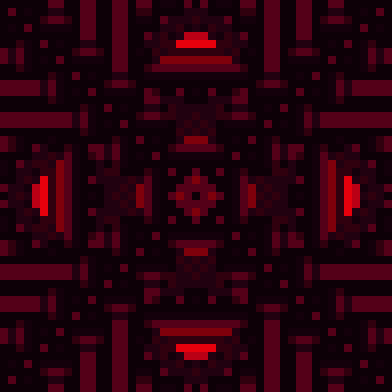
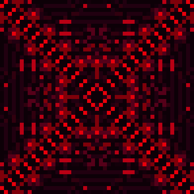
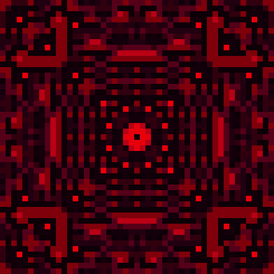
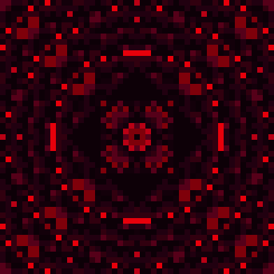
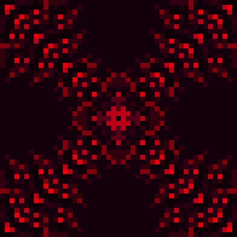
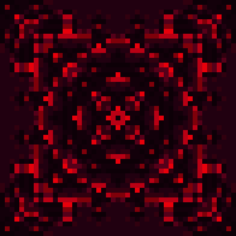
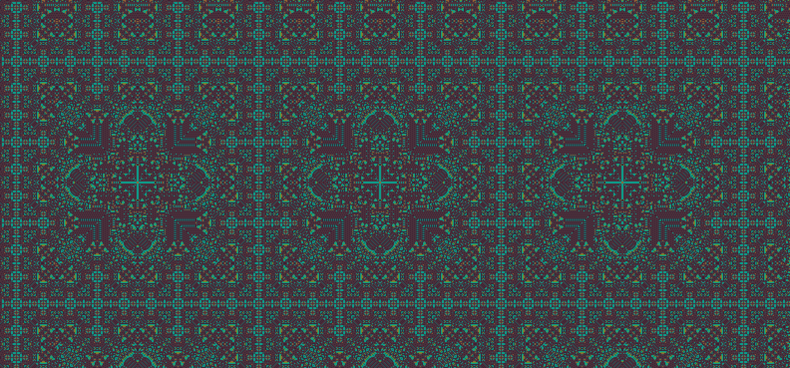

<h6 align="center"><i>"sorry, wish we could go to the moon together."</i><h6>

<h1 align="center" id="about-ellie"><strong>✨About Ellie✨</strong></h1>

 

<h4 id="-education-in-progress">📚 Education: In Progress</h4>

* *Associate In Science - Mesa Community College - Completed in 2020*
* *B.S. Computer Science - Ira A. Fulton Schools of Engineering - Completed in 2023*
* *M.S. Computer Science - Georgia Tech - In progress - August 2024*
#### 📫 Reach Me At: evcmoore@gmail.com
#### 👾 Pronouns: She/Her
#### 🍥 Anime: 
* Stein's;Gate
* Cyberpunk: Edgerunners
* 86
* Cowboy Bebop
* Neon Genesis Evangelion
* Violet Evergarden
* Frieren
* Madoka Magica
* Death Parade
* Samurai Champloo
* Ranma 1/2
* So much more that I can't think of right now...
#### ✍️ Other Animations: 
* Arcane
* Blue Eye Samurai
#### 🍂 Favorite Season: Fall
#### ⚡ Interests: Artificial Intelligence, Data Structures, Low-Level Programming, Algorithms, Math, Design Patterns
#### (I dump lots of code on here... Most of it is pretty bad... Read at your own risk lol)

<h1 align="center" id="statistics"><strong>📈 Statistics 📈</strong></h1>

 
   
 

<h1 align="center" id="pins"><strong>📌 Pins 📌</strong></h1>

 
  
 
 
 
 

 
<h1 align="center" id="favorite-projects"><strong>💖 Favorite Projects 💖</strong></h1>

<h2 align="center" id="homura">
  <strong><a href= "https://github.com/RedBedHed/Homura">Homura (2023)</a></strong>
</h2>

#### **A UCI-Subset Chess Engine and 2022-2023 Undergraduate Project**

<pre>
 <code>
uci
id name Homura
id author Ellie Moore
uciok
isready
readyok
go movetime 5000
info depth 1 score cp 36 nodes 20
info pv g1f3
info depth 2 score cp 0 nodes 40
info pv g1f3 g8f6
info depth 3 score cp 35 nodes 132
info pv d2d4 g8f6 g1f3
info depth 4 score cp 0 nodes 160
info pv d2d4 g8f6 g1f3 d7d5
info depth 5 score cp 33 nodes 119
info pv d2d4 g8f6 g1f3 d7d5 b1c3
info depth 6 score cp 1 nodes 343
info pv b1c3 g8f6 e2e4 b8c6 d2d4 d7d5
info depth 7 score cp 26 nodes 603
info pv b1c3 g8f6 d2d4 b8c6 c1f4 d7d5 g1f3
info depth 8 score cp 15 nodes 805
info pv b1c3 g8f6 d2d4 b8c6 d4d5 c6e5 g1f3 d7d6
info depth 9 score cp 19 nodes 1030
info pv b1c3 b8c6 d2d4 d7d5 g1f3 g8f6 c1e3 e7e6 f3e5
info depth 10 score cp 7 nodes 4412
info pv b1c3 b8c6 e2e4 g8f6 g1f3 d7d5 e4d5 f6d5 c3d5 d8d5
info depth 11 score cp 14 nodes 3222
info pv b1c3 d7d5 d2d4 g8f6 g1f3 b8c6 f3e5 e7e6 c1f4 f8d6 a1c1
info depth 12 score cp 21 nodes 15226
info pv e2e4 b8c6 g1f3 e7e5 b1c3 g8f6 f1b5 c6d4 e1g1 d4b5 c3b5 f8c5
info depth 13 score cp 18 nodes 4067
info pv e2e4 e7e5 g1f3 g8f6 b1c3 b8c6 d2d4 e5d4 f3d4 c6d4 d1d4 c7c5 d4d1
info depth 14 score cp 9 nodes 5464
info pv e2e4 e7e5 g1f3 b8c6 b1c3 g8f6 f1d3 f8d6 c3b5 e8g8 e1g1 d6c5 c2c4 d7d6
info depth 15 score cp 20 nodes 1632
info pv e2e4 e7e5 g1f3 b8c6 b1c3 g8f6 d2d4 e5d4 f3d4 c6d4 d1d4 f8d6 f1d3 e8g8 e1g1
info depth 16 score cp 10 nodes 496
info pv e2e4 e7e5 g1f3 b8c6 b1c3 g8f6 d2d4 e5d4 f3d4 c6d4 d1d4 f8d6 f1d3 e8g8 e1g1 h7h6
info depth 17 score cp 14 nodes 2991
info pv e2e4 e7e5 g1f3 b8c6 b1c3 g8f6 d2d4 e5d4 f3d4 f8b4 d4c6 b7c6 e4e5 f6e4 c1d2 d8h4 d1e2
info depth 18 score cp 16 nodes 48604
info pv e2e4 e7e5 g1f3 b8c6 b1c3 g8f6 f1d3 d7d5 e4d5 f6d5 c3d5 d8d5 e1g1 f8d6 f3g5 c8e6 g5e6 d5e6
info depth 19 score cp 21 nodes 19822
info pv e2e4 e7e5 g1f3 b8c6 b1c3 g8f6 d2d4 e5d4 f3d4 f8b4 d4c6 b7c6 e4e5 f6e4 d1f3 d8h4 f1e2 e8g8 e1g1
info depth 19 nodes 194708
bestmove e2e4
 </code>
</pre>

<h2 align="center" id="pixel-art-time-waster-9000">
 <strong><a href= "https://github.com/RedBedHed/Pixel-Art-Time-Waster-9000">Pixel Art Time Waster 9000 (2023 Doodle)</a></strong>
</h2>

 
 
 
 
 
 
 
 

<h2 align="center" id="rug-cellular-automata">
  <strong><a href= "https://github.com/RedBedHed/Some-Cellular-Automata">Rug Cellular Automata (2022 CSE355 Project)</a></strong>
</h2>

 

 
<h2 align="center" id="charon-perft-2021">
  <strong><a href= "https://github.com/RedBedHed/Charon">Charon Perft (2021)</a></strong>
</h2>
 
#### **A stockfish (and lc0) inspired move generator for the game of chess.**
 
###### *(single-threaded, 1.6 ghz i5, strictly-legal moves only.)*

 <pre>
  <code>

     @@@    @@
   @@   @@  @@
  @@        @@ @@@      @@@@    @@ @@@      @@@@    @@ @@@
  @@        @@@   @@  @@   @@@  @@@   @@  @@    @@  @@@   @@
  @@        @@    @@  @@    @@  @@        @@    @@  @@    @@
   @@   @@  @@    @@  @@   @@@  @@        @@    @@  @@    @@
     @@@    @@    @@   @@@@ @@  @@          @@@@    @@    @@

~^*^~._.~^*^~._.~^*^~._.~^*^~._.~^*^~._.~^*^~._.~^*^~._.~^*^~.

        .~* Charon Perft *~.

        *. by Ellie Moore .*

        Starting Position:

            H   G   F   E   D   C   B   A
          +---+---+---+---+---+---+---+---+
        1 | R | N | B | K | Q | B | N | R | 1
          +---+---+---+---+---+---+---+---+
        2 | P | P | P | P | P | P | P | P | 2
          +---+---+---+---+---+---+---+---+
        3 |   |   |   |   |   |   |   |   | 3
          +---+---+---+---+---+---+---+---+
        4 |   |   |   |   |   |   |   |   | 4
          +---+---+---+---+---+---+---+---+
        5 |   |   |   |   |   |   |   |   | 5
          +---+---+---+---+---+---+---+---+
        6 |   |   |   |   |   |   |   |   | 6
          +---+---+---+---+---+---+---+---+
        7 | p | p | p | p | p | p | p | p | 7
          +---+---+---+---+---+---+---+---+
        8 | r | n | b | k | q | b | n | r | 8
          +---+---+---+---+---+---+---+---+
            H   G   F   E   D   C   B   A

        perft(1) -   0.000 seconds -          20 nodes visited.
        perft(2) -   0.000 seconds -         400 nodes visited.
        perft(3) -   0.000 seconds -        8902 nodes visited.
        perft(4) -   0.000 seconds -      197281 nodes visited.
        perft(5) -   0.016 seconds -     4865609 nodes visited.
        perft(6) -   0.344 seconds -   119060324 nodes visited.
        perft(7) -   9.047 seconds -  3195901860 nodes visited.
        perft(8) - 249.016 seconds - 84998978956 nodes visited.
        
~^*^~._.~^*^~._.~^*^~._.~^*^~._.~^*^~._.~^*^~._.~^*^~._.~^*^~.
  </code>
 </pre> 

<h2 align="center" id="tetris-2020">
  <strong><a href= "https://github.com/RedBedHed/Tetris">Tetris (2020)</a></strong>
</h2>

 

